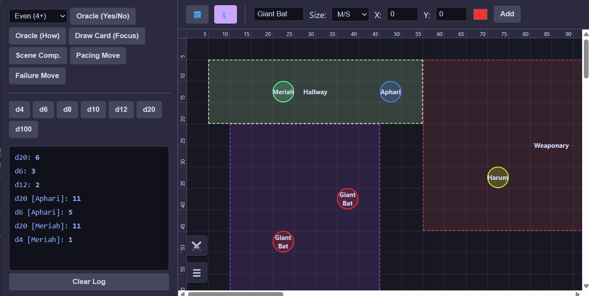

# Solo DnD Tracker

This application aims to support DnD players that want to explore some DnD gameplay solo.
It also makes quite a nice tool for DMs that want to play through some encounters or tryout ideas in the world of DnD.

Based on the [One Page Solo Engine by Inflatable Studios](https://inflatablestudios.itch.io/one-page-solo-engine)

## How to use

* Open the solo_dnd.html in your browser
* Serve the folder from a local web server before opening `dm-quiz.html`; the quiz loads its formatted question bank from `dm-questions.json`. An active quiz session is saved in local storage so it can be resumed after reopening the page.

## Features

* A digital 5x5 ft game board
    * Add, edit and remove rooms to game board
    * Add, edit and remove tokens to game board (players, NPCs, etc...)
    * Move tokens via drag and drop
    * Add background image (for reference: 5ft = 40px)
* Manage hp and initiative of tokens (click token to add it to initiative list)
* Access Solo Engine options
* Roll dice (d4 to d100)
* Import & export rooms, tokens and initiative list
* DM Quiz Show with a 30-question session, fixed 9,000-point ceiling, and multiple-choice answers
* Persistent quiz total, resumable sessions, and local leaderboard
